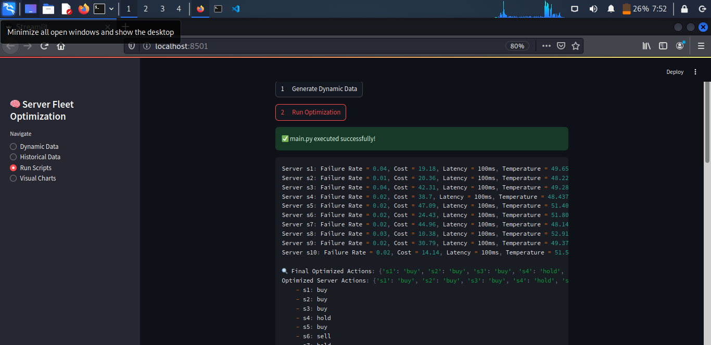
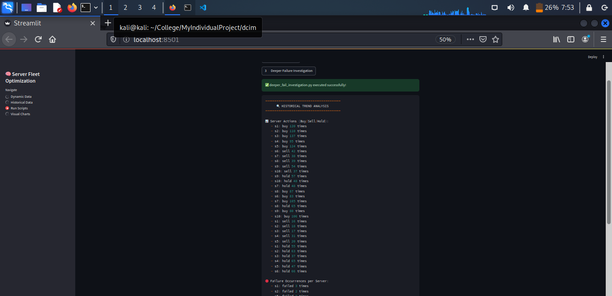
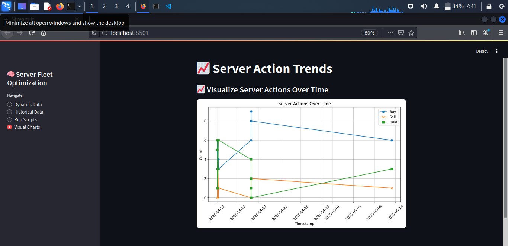

# 🧠 AI-Powered Infrastructure Intelligence System

This repository presents an AI-enhanced platform focused on the intelligent optimization, monitoring, and forensic analysis of data center infrastructure using Large Language Models (LLMs), Reinforcement Learning (RL), and modular DevOps pipelines.

It is built with production-grade architecture, featuring NLP integration via OpenAI APIs (GPT-4), customizable prompt engineering, and full compatibility with MLOps pipelines, CI/CD workflows, and NVIDIA RL technologies.

---

## 🚀 Overview

- 💡 Developed with advanced **LLM prototyping principles**
- 🧠 Supports OpenAI’s **GPT-4 / GPT-3.5-turbo** models
- 🧪 Built for **testable**, **scalable**, and **secure** deployments
- 🔁 Compatible with **CI/CD**, **containerization**, and **RL** feedback loops
- 🧊 Integrates easily with **NVIDIA AI Enterprise** and **Reinforcement Learning workflows**

---

## ✨ Key Features

### ✅ LLM & GenAI Capabilities

- Utilizes OpenAI’s `ChatCompletion` API for AI-based reasoning, analysis, and anomaly detection
- Built-in prompt engineering, rate-limit handling, and structured logging
- Easily extendable to:
  - Retrieval-augmented generation (RAG)
  - Chain-of-thought planning
  - Multimodal prompt ingestion

### 🛠️ MLOps-Ready Architecture

- 🐳 Containerized with Docker
- 🔁 CI/CD integration with GitHub Actions
- Configurable deployment across dev, test, and production stages
- Fully supports modular JSON I/O pipelines, logging, and recovery mechanisms

### 🔬 RL & NVIDIA Compatibility

- Architecture supports integration with:
  - NVIDIA **Triton Inference Server**
  - **RLHF feedback** modeling
  - Custom **reward signal processing**
- Future-ready for **fine-tuning**, **RL control loops**, or **digital twin feedback**

---

## 🧩 Tech Stack

| Layer              | Technology                          |
|-------------------|--------------------------------------|
| Language Model     | OpenAI GPT-4 (ChatCompletion API)   |
| Backend Scripts    | Python 3.9+                          |
| Web UI             | Streamlit                           |
| Containers         | Docker                              |
| CI/CD              | GitHub Actions                      |
| RL Readiness       | NVIDIA AI Stack (RLHF / Triton)     |

---

## 🛡️ Security & Reliability

- ✅ Secure API key handling (.env / dotenv)
- ✅ Exponential backoff for API rate limits
- ✅ Subprocess sandboxing for GUI triggers
- ✅ Full audit trail of AI-generated logs
- ✅ Output validation and formatting enforcement

---

## 📈 Project Structure


---

## 📊 Use Cases

- 📡 Server fleet monitoring and predictive scaling
- 🔐 AI-based forensic incident investigation (e.g., suspicious failure chains)
- 🧠 Adaptive infrastructure control using LLM logic
- 📉 Real-time anomaly detection via hybrid ML/statistical inference
- 💸 Cost-aware infrastructure decisions (power, cooling, latency optimization)

---

## 🖥️ Run Locally

### 🔧 Prerequisites

- Python 3.9+
- OpenAI API key (`export OPENAI_API_KEY=your-key`)
- `pip install -r requirements.txt`
- Docker (optional for full isolation)

### ▶️ Start the Streamlit GUI

```bash
streamlit run app.py

## 🚀 Features Walkthrough

Here’s a visual overview of how the AI-Powered DCIM Server Fleet Optimizer works from GUI to decision logic.

---

### 🧭 1. Main Dashboard — Streamlit GUI


A clean and intuitive web interface built with **Streamlit**. From here, you can:
- Generate new dynamic server/environment/network/failure data
- Run optimization logic (buy/hold/sell decisions)
- Launch deeper historical analysis
- Trigger visualization modules
Within you can see i generated the dynamic data

---

### 🔁 2. Server Fleet Optimization Output


This module analyzes real-time performance metrics like:
- Server failure rate
- Latency
- Energy cost
- Thermal temperature

🧠 Applies **buy/hold/sell** logic using cooldown & fatigue tracking to prevent premature decisions.

---
### 🔍 3. Deeper AI-based Failure Trend Analysis


A CLI-style investigation script that parses:
- AI analysis text for failed vs operational servers
- Tracks server-specific failure frequency
- Summarizes environment/network-related anomalies
- Parses failure + environment + network logs
- Returns structured failure analysis & recommendations
- Enhances traditional rule-based alerts with **LLM intelligence**

---

### 📊 4. Visualized Server Actions Over Time


Interactive **Matplotlib** or **Altair** chart showing:
- Buy/Hold/Sell trends over historical timestamps
- Identifies recurring decision patterns
- Helps spot action volatility and fatigue misfires

---

---

### 📁 6. Data & Logs Management
- JSON-based input/output system
- Historical runs saved in `/output/historical_results.json`
- Simplified logs for actions: `/output/server_actions.json`

Each run is **timestamped**, reproducible, and easily parsed for forensics or regression checks.

---

## 🎯 Why These Features Matter

These features work together to:
- Empower decision-making with explainable AI
- Track infrastructure fatigue and avoid overbuying
- Offer **real-time insights** into server performance
- Help IT/DevOps/Data Center teams make cost-aware, fault-resilient decisions
- Maintain forensic-grade evidence for compliance or security review

---

